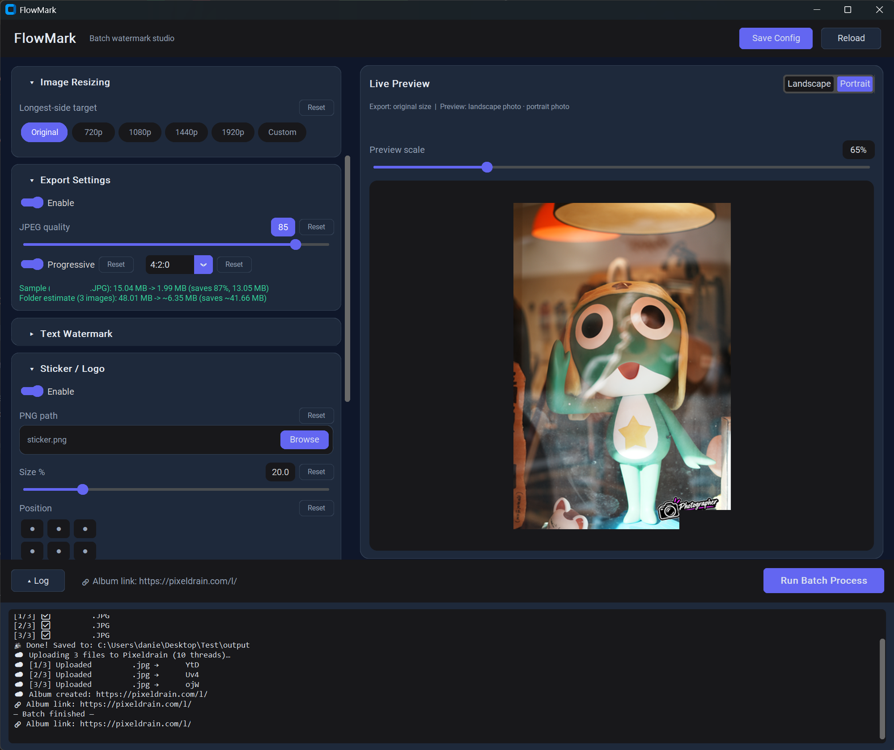

# FlowMark

Batch watermark images with text and/or a PNG sticker. Includes a GUI and CLI.



## Features

- Text and sticker watermarks
- Resize and JPEG export options
- Live preview (GUI)
- Optional Pixeldrain cloud upload
- Multithreaded batch processing

## Requirements

- Python 3.9+
- Pillow, CustomTkinter

## Setup

```bash
python -m venv .venv
.\.venv\Scripts\Activate.ps1   # Windows
# source .venv/bin/activate    # macOS/Linux
pip install -r requirements.txt
```

## Usage

GUI:

```bash
python gui.py
```

CLI:

```bash
python flowmark.py
```

Settings are stored in `config.json` (local, not committed).

## Supported formats

Input: `.jpg`, `.jpeg`, `.png`  
Output: `.jpg` (default folder: `<input>/output`)
